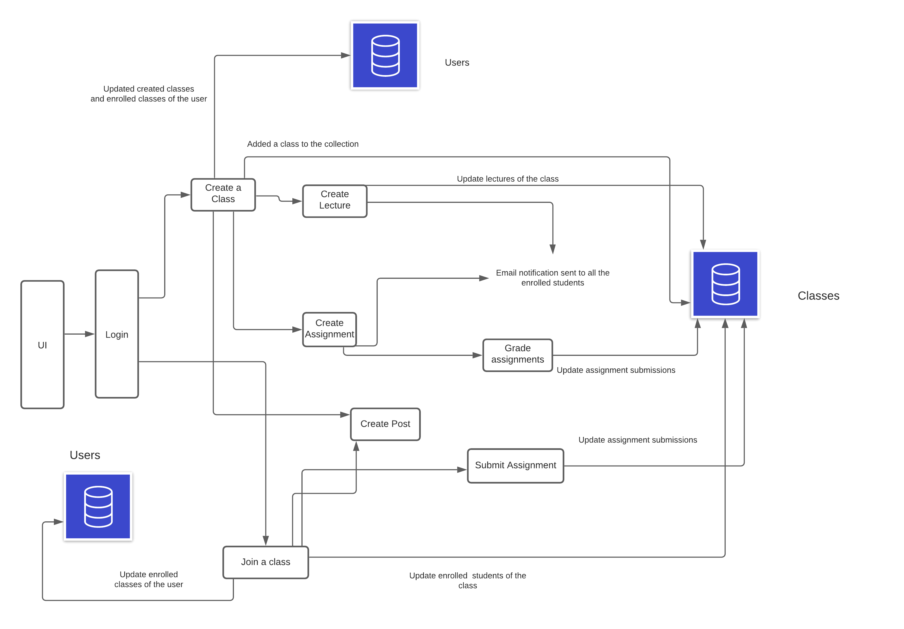
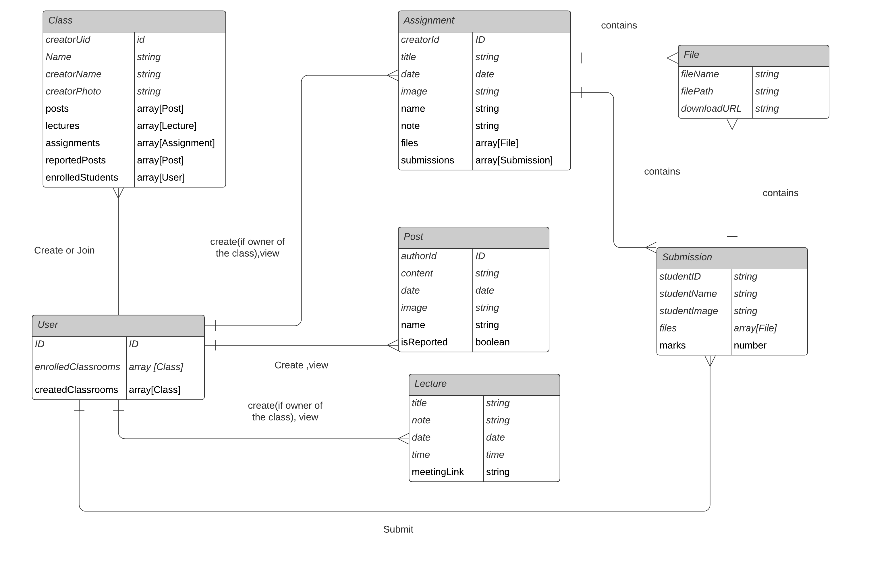

# Vorlesung- A virtual classroom application

This project has been developed for the Microsoft Engage Program 2021.The main motivation behind this project is to make remote teaching and learning easier. It helps teachers create classes and share assignments and lectures with the students. It also has a discussion forum to encourage interaction between the students and their teachers. Everytime, an assignment or  a lecture is created, all the students enrolled in the class get notified via email.

## Live Demo

To see the app in action, go to [https://virtual-classroom-b6fed.web.app/](https://virtual-classroom-b6fed.web.app/)

## Presentation Link:

[https://www.canva.com/design/DAExAusV3f0/BsgDnDclHcMzbYhnzmAZhg/view?utm_content=DAExAusV3f0&utm_campaign=designshare&utm_medium=link&utm_source=sharebutton](https://www.canva.com/design/DAExAusV3f0/BsgDnDclHcMzbYhnzmAZhg/view?utm_content=DAExAusV3f0&utm_campaign=designshare&utm_medium=link&utm_source=sharebutton)

## The Challenge

Build a functional prototype of a platform that gives students an array of digital academic and social tools to stay engaged with their studies, peers and broader university community during pandemic.

## Features

- Authentication:

  - Users can login with their Google Account

  - Admin sign-up with admin code

- For Teachers:

  - Create a Class and share the Class Code with the students.

  - Create Lectures.

  - Discuss with students.

  - Create Assignments.

  - Grade Assignments.

  - Delete reported posts, if found to be offensive.
  


- For students:

  - Join a class using the code shared by the teacher.

  - Discuss with your teachers and peers.

  - Get notified via email when an assignment or lecture is created by the teacher.

  - View lecture information.

  - View and submit assignments.

  - Report posts.

## Design 



## ER Diagram



## Limitations and Further Improvements

- Currently, only 200 emails per month can be sent(because of subscription limits). Email notifications can be included for other events (like notifying the teacher when a student submits an assignment) in the future.

- Firebase hosting limits- Can handle 10K requests per month.

- Firebase database limits and storage limits.

- App can be further optimised by caching resources that are not changed frequently.


## Getting Started


### Clone or download this repository

```sh
git clone https://github.com/rheasharma13/Vorlesung--A-Virtual-Classroom-App.git
```

### Install dependencies

```sh
npm install
```

or

```sh
yarn install
```

### Run the app

```sh
npm start
```

## Built with

### Front-end

- [React](https://reactjs.org/)


### Back-end

- [Firebase](https://firebase.google.com)
- [Firebase Real Time Database (NoSQL)](https://www.firebase.google.com/)
- [Firebase Storage (for files)](https://firebase.google.com/)
- [Emailjs- For sending emails](https://emailjs.com)


### Platforms

- [Firebase Hosting](https://www.firebase.google.com/)

